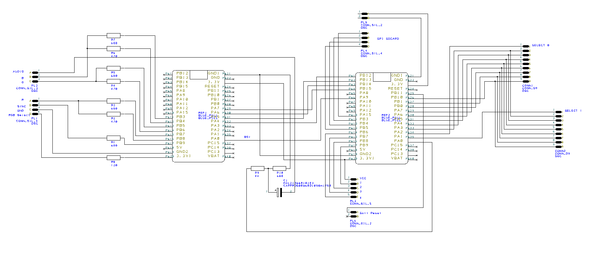

# Fairchild Channel F Emulator in Rust - Running on two STM32F103

## About

This is a Fairchild Channel F emulator running on two STM32F103 BluePills connected via SPI.
It reads games from an SD-card and outputs video and audio via SCART cable.

While the Channel F wasn't really a great machine it's a remarkable step in history of video game consoles.

If you want to learn more about the Channel F visit these links
- https://en.wikipedia.org/wiki/Fairchild_Channel_F
- https://www.fastcompany.com/3040889/the-untold-story-of-the-invention-of-the-game-cartridge
- http://www.computinghistory.org.uk/det/5768/Adman-Grandstand-%28Fairchild-Channel-F%29-Video-Entertainment-Computer/

## Sources used to implement the emulator

- https://github.com/libretro/FreeChaF/blob/master/src/f8.c
- https://www.lexaloffle.com/bbs/?pid=71273
- http://channelf.se/veswiki/index.php?title=Main_Page
- MAME

ROMS found on archive.org

It can run most games but some games don't work or have minor problems. (e.g. Maze doesn't work but I have no idea why)

## Code Organization

|Directory|Contents|
|---|---|
|chf-emulator|the emulator core|
|desktop|a desktop implementation of the emulator - just for testing - otherwise bad|
|main|code running on the "main" MCU, compile in release mode, talks to the other MCU via MCU|
|video|code running on the "video" MCU, must be compiled in release mode, get the pixel data from the other MCU via SPI|
|gen-test-bin|generates a catrdige with random opcodes, I used MAME to generate a log to check in a unit test|

## Hardware

The hardware is built from two BluePill STM32F103 modules, some resistors and a capacitor.

Video output is done via a SCART cable.

Cartridges are stored on an sd-card - the reader is connected via SPI.

The two MCUs communicate via SPI.
